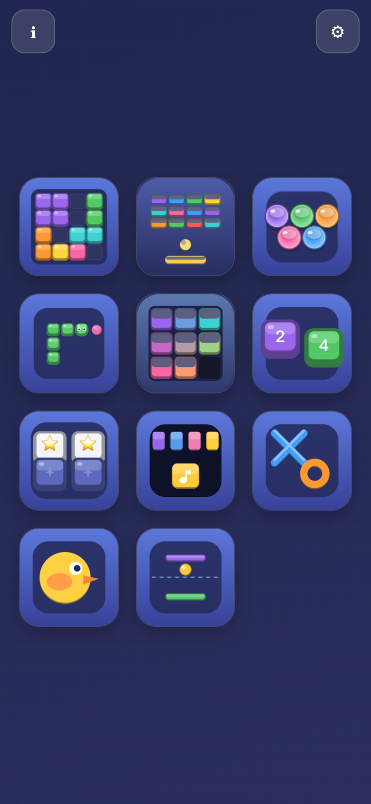
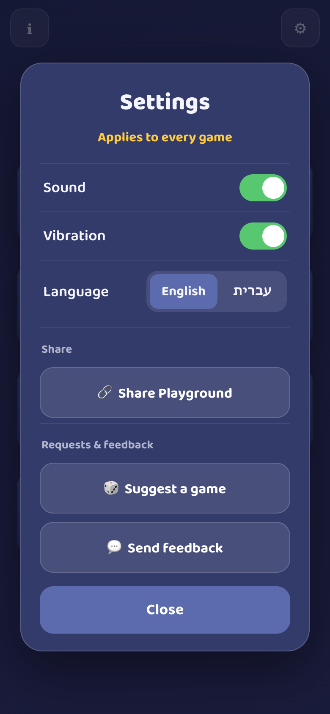
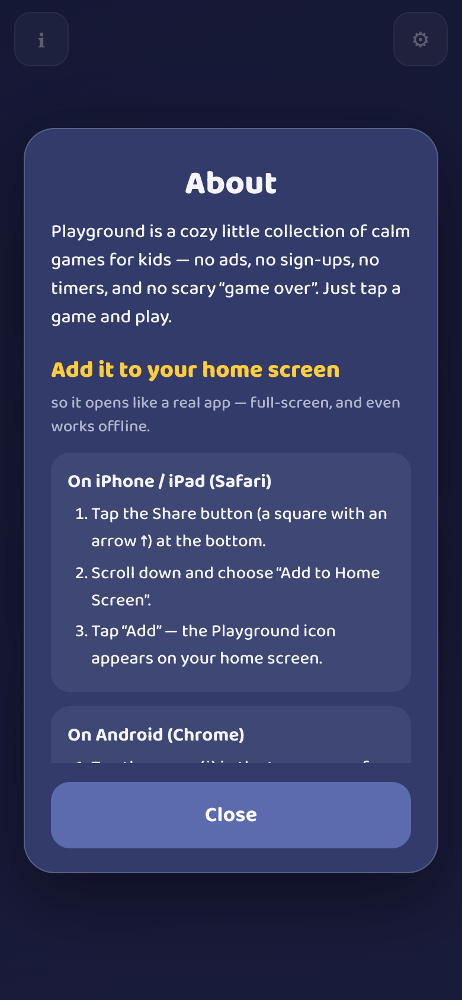

# Playground 🎮

A calm, ad-free collection of simple games for kids — a lightweight web hub that
launches small, independent game sites.

**Live:** https://mpmisha.github.io/playground/

## Screenshots

<p align="center">
  
  
  
</p>

## How it works

- This repo is just the **menu**. Each game lives in its **own** public repo with
  its own GitHub Pages site (e.g. [`block-grid-kids`](https://github.com/mpmisha/block-grid-kids)).
- The menu is driven by [`games.json`](games.json). Adding a game = publish its
  repo to Pages, then add one entry here.
- When you tap a game, the hub opens it with `?hub=<hub url>` so the game's
  **← Back to Games** button returns here.

## Repo layout

```
playground/
├── index.html            # the menu shell
├── styles.css            # calm menu styling
├── js/main.js            # loads games.json, renders cards, launches games
├── games.json            # the game registry (edit this to add games)
├── manifest.webmanifest  # installable PWA
├── service-worker.js     # offline shell + network-first registry
├── icons/                # hub app icons
├── shared/               # conventions shared by games (see ADDING_A_GAME.md)
├── docs/
│   ├── agent-tooling.md  # canonical Copilot tooling guide
│   └── screenshots/      # README images
├── scripts/              # sync_copilot_assets.py: personal snapshot installer
├── tests/                # test_copilot_assets.py: tooling validation
└── .github/
    ├── agents/           # editable source for four Playground agents
    ├── skills/           # editable new-game-orchestration skill and resources
    └── workflows/        # existing Pages deploy + separate agent-assets CI
```

## Copilot tooling

Playground-specific agents, the `new-game-orchestration` skill, and GitHub Actions
workflow definitions are maintained **only in this repo**, through the normal
branch/review flow. Personal `~/.copilot/agents` and `~/.copilot/skills` copies are
install outputs for **global use**, including from independent game repos—not a
second editable source.

Run `python3 scripts/sync_copilot_assets.py --check` from this checkout to find
drift. See [Agent tooling](docs/agent-tooling.md) for safe installation, explicit
refresh, backups, and validation. Nothing auto-installs or live-syncs; GitHub
Actions workflows remain repo-scoped.

## Adding a new game

1. Build the game as its own self-contained static site (a folder of HTML/CSS/JS),
   following [`shared/ADDING_A_GAME.md`](shared/ADDING_A_GAME.md).
2. Push it to a **public** repo and enable GitHub Pages.
3. Add one entry to [`games.json`](games.json):

   ```json
   {
     "id": "maze",
     "name": "Maze",
     "tagline": "Find the way out",
     "icon": "🐭",
     "color": "#7ac5a8",
     "image": "https://mpmisha.github.io/maze/icons/icon-192.png",
     "url": "https://mpmisha.github.io/maze/"
   }
   ```

4. Commit — the menu updates on next load (registry is fetched network-first).

That's it — no code changes to the hub.

## Design rules (calm by default)

No ads. No purchases. No analytics/tracking. No external links. No timers or
pressure. Muted palette, gentle (mutable) sound, minimal splashes. Everything a
kid can safely tap.

## Local preview

```bash
python3 -m http.server 8000
# open http://localhost:8000/
```

## Install to a phone

Open the live URL in Safari (iOS) or Chrome (Android) → Share/menu →
**Add to Home Screen**. It launches full-screen like an app and works offline.
